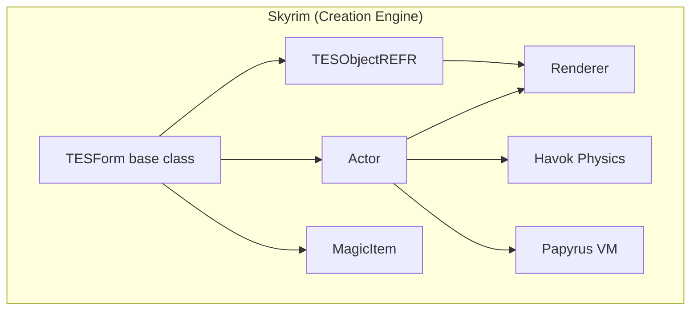
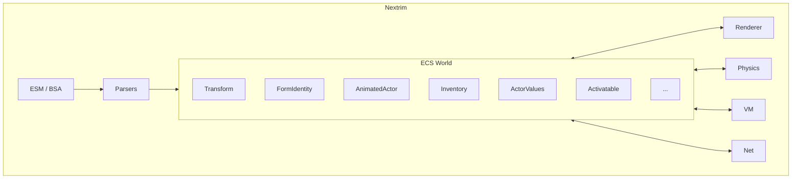
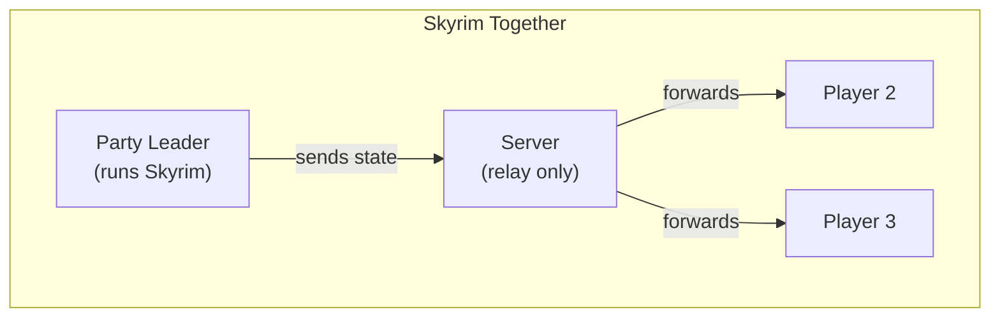
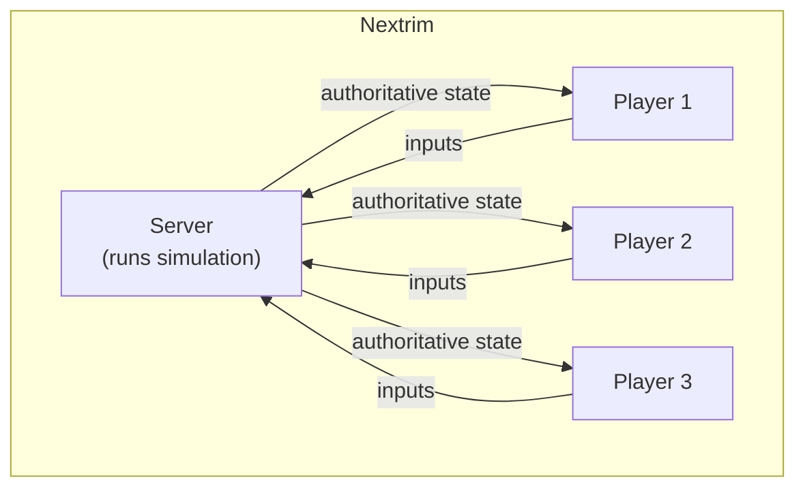

# Nextrim: Update 2
This blog series is here to document my progress on Nextrim and the technical stuff i learned along the way. Updates will come whenever i have new stuff to show. The [first update](https://youtu.be/9QMVp8NR1FI) was just a video, so this is the first written one. Let me give you some context before diving in.

https://youtu.be/U8u579tlzrE

## First: The "why - whyyy would you do that?!"

Skyrim is a very old game at this point. I've enjoyed it pretty much since release. And even though modding efforts like CommonLibSSE have increasingly documented the engine internals, the game at its core is still closed source. You have to work around its limitations. Sure, you can achieve almost anything by patching the game's memory and functions, but it's still written as a singleplayer experience with a ton of assumptions baked in that can't be easily worked around. I noticed that especially when working on Skyrim Together.

Speaking of Skyrim Together: for those who don't know me, I contributed to the reborn iteration of it from around 2019 to 2022. After that I stayed on as maintainer for a while. Before that I wrote my own mods. So I have some familiarity with the engine's internals, which helps with knowing what formats to expect and where the pain points are.

So I've went and did my own thing, as i tend to do, and spent the last few weeks building a more modern engine from scratch that can load Skyrim's assets and run its game scripts.

## Why this is not a decompilation effort

I'm not interested in a 1:1 reimplementation. There are already wonderful projects like OpenMW that do that much better than i could. Bethesda's architecture made sense for what they were shipping on (Xbox 360, PS3), but those constraints don't apply to a new project in 2026. So rather than faithfully recreating their design, i'd rather just read the same data formats and build something new on top. And honestly, spending years decompiling each function to match the original byte for byte just doesn't sound fun to me.

So Nextrim is its own thing. C++/Vulkan, ECS-first, modern rendering stack. Loads ESMs and BSAs, parses NIFs, runs Papyrus in its own VM. No Bethesda code, no binary patching. Runs on Linux natively, which is where I've been developing it.

Part of the motivation is also just wanting to understand how all of it works under the hood. Skyrim is a good target for that because the community has documented most of the formats already, and the game is complex enough to keep things interesting for me.

Here's roughly how Skyrim does it vs what Nextrim does:

Skyrim uses a deep class hierarchy rooted in `TESForm`. An Actor is a TESObjectREFR is a TESForm, and each layer adds virtual methods and state. That works, and it shipped a massive game, but it couples everything together. In Nextrim, entities are just IDs with components attached. Systems query the components they care about and nothing else. Adding networking doesn't mean touching every game object class, it just means writing another system that reads and writes components.

There's also a performance angle. With a class hierarchy, objects end up scattered across the heap and it's hard to run things in parallel because any system can poke into any object's state. With an ECS, components of the same type sit next to each other in memory (way better for cache), and since systems declare what they touch, you can just run the ones that don't overlap at the same time. I haven't fully exploited this yet, but the architecture is set up for it.

With all of that said, here's some progress I've made:

## (Basic) Skeletal Animation & Physics

This took the most time by far. Before mid-March all characters and creatures rendered T-posing. Getting them to actually move meant two things: parsing Havok's animation format, and integrating a physics engine.

### The HKX format

I wrote my own HKX animation loader from scratch. HKX is Havok's packfile format, and Skyrim uses it for both skeletons and animations. The file has a header, section headers, and a system of "fixups" that are basically pointer relocation tables. You need to resolve all of those before you can make sense of the actual data.

The animations use something called `hkaSplineCompressedAnimation`. Each bone gets a track with a 4-byte mask describing how it's compressed. Position and scale can be stored as static values or as B-spline curves with 8-bit or 16-bit quantized control points. At runtime you evaluate the spline with de Boor's algorithm to get the value at the current time.

Rotations are the real pain. There are six different quaternion packing schemes ranging from 16-bit all the way to uncompressed float32, each reconstructing the fourth component from the other three. Getting even one of these wrong produces... well:

(And no, AI is not helpful with this kind of thing in any way.) I spent days going back and forth between hex dumps and existing community documentation. The nastiest bug was reading static values in separate passes per component instead of interleaved, which produced NaN rotations on some tracks but not others. Took a while to track down.

### Havok-to-NIF bone mapping

The other headache: Havok skeletons and NIF skeletons don't agree on bone ordering, and sometimes not even on which bones exist. Havok can have "virtual bones" like `x_NPC LookNode` that sit in the parent chain but have no NIF counterpart. So you can't just map track N to bone N.

The loader parses both hierarchies, matches bones by name, and builds an index map. Virtual bones get mapped to -1 but still contribute their transforms during evaluation. At the end everything gets mapped back into NIF bone space through a precomputed correction matrix.

### Blending and state transitions

The blender is a simple two-layer setup: a current clip and a target clip, cross-fading over about 0.2 seconds. Translation blends linearly, rotation uses SLERP. Different body parts have different blend weights to keep things stable: fingers only take 25% from the animation, hands 45%, arms 90%, legs 100%. Without this, fingers jitter all over the place while the legs look fine.

Each mesh part gets its own range in a shared bone palette SSBO on the GPU. The final matrix per bone is a chain of the bind correction, the skin transform, the animated world transform, and the inverse bind pose. The bind correction is precomputed at load time so at rest everything cancels out to identity.

### Physics with Jolt

For physics, even I am not madman enough to roll my own, so i've begun using [Jolt](https://github.com/jrouwe/JoltPhysics). It was originally written by Jorrit Rouwe at Guerrilla Games and shipped in Horizon Forbidden West, so it's battle tested. Also open source, multithreaded, and runs on everything. Using Jolt instead of Havok means no licensing headaches, but it also means i have to translate all the Havok constraint data in the assets into Jolt's equivalents. The human skeleton has 18 ragdoll bones with 17 constraints between them, and each one needs to be mapped to the right Jolt joint type. Many hours went into that.

## Reimplementing the Papyrus VM

Compared to the animations, i've had the Papyrus VM executing bytecode fairly quickly, having messed with reversing it in the past for Skyrim Together. The bytecode format (PEX) is well understood at this point, so parsing and executing instructions wasn't the hard part.

The hard part is the natives. Papyrus scripts don't do much on their own, they constantly call into the engine through native handler functions. `ObjectReference.Disable()`, `Actor.AddSpell()`, `Game.GetGameSettingFloat()`, stuff like that. There are hundreds of them. So far I've registered stubs for all of them (nothing crashes, no unresolved symbols) and i'm replacing them with real implementations one by one.

My goal here for now is to get MQ101 (the Helgen intro) to run properly. Debugging it revealed it runs about 102K VM instructions and 10K native calls without failing so far, but of course not much happens, since many of the natives required are still to be implemented.

## Bringing the game to android

I got a shiny new OnePlus 15 about a week ago. 512gb storage, 16gb ram, and an Adreno 840 GPU. Naturally i wanted to know what it can do, so i added android support to the engine. Modern phones support Vulkan out of the box, so it was mostly smooth sailing. Of course there were the usual mobile vendor bugs: Adreno GPUs returning more swapchain images than you'd expect, happily overflowing your semaphore arrays, that kind of thing.

Got it working within two days though. Skyrim's overworld renders nicely at 60+ fps. Still needs a proper mobile graphics preset down the line, but its a start :D

Check it out in action here:

https://youtu.be/qE4Wh_avn_w

## Multiplayer

Coming from me, of course multiplayer had to be in there from day one (lol).

I've been baking networking into the engine level directly, so it is not bolted on after the fact like we did with Skyrim Together (Not that we had a choice). Right now there's a Linux server with basic state sync, chat, and entity updates. Still very early. 

The big difference compared to ST is that a proper authoritative server becomes possible. Here's what that looks like:

With ST, the server was basically a relay. One player's game process was the source of truth and everyone else just received their state. If that player lagged or desynced, everyone felt it. With Nextrim the server runs the actual simulation, so it can validate inputs and all clients get the same authoritative state. Having our own engine is what makes that possible.

On the technical side, for Skyrim Together we used Valve's [GameNetworkingSockets](https://github.com/ValveSoftware/GameNetworkingSockets) back in the day. It works, but it's fairly heavy, tied to Steam's ecosystem, and primarily designed for client-server. For this project i've chosen to use my own networking library [zetanet](https://github.com/Force67/zetanet) instead. I originally wrote it as a RakNet replacement for modding work. It's lighter, has built-in P2P with host migration, supports mixed reliable/unreliable channels, and doesn't pull in half of Steam's infrastructure. It also has built-in file transfer, which will be useful later for syncing mod assets between players.

## whats next?
I'm working on overhauling the entire rendering pipeline next, expect a detailed post on the new rendering pipeline.

---

If you made it this far through all the HKX byte layouts and quaternion packing schemes, thanks for reading. Feel free to reach out on [GitHub](https://github.com/Force67) or hit me up on Discord (vinzem) if any of this is interesting to you or if you want to get involved.
